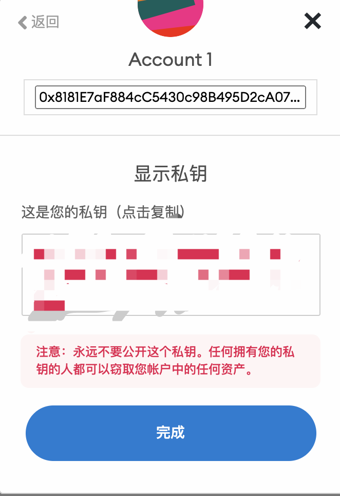

# sinso

#### 介绍
半自动部署sinso项目

#### 安装教程

1.  安装sinso的客户端
    wget https://github.com/sinsoio/mine_publish/archive/refs/tags/v1.0.2.tar.gz
    &&    tar -xvf v1.0.2.tar.gz
    &&    cd mine_publish-1.0.2/ && chmod 755 sinso && sudo cp sinso /usr/local/bin
2.  mkdir /data 目录
3.  执行脚本 ./sin.sh
4.  输入相应的数字不能写重复的数字，如果需要写重复的数字删除/data 下面对应的目录
5.  按照提示输入节点的私钥可开始挖矿，建议使用空白没有其他资产的私钥

并且定期领取bnb测试币，燃料烧干之后就没有收益了
